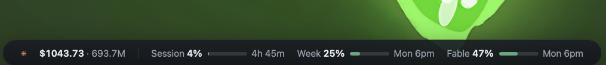
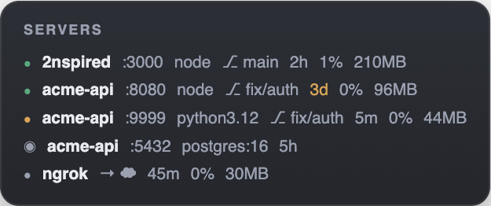

# ubersicht-widgets

A collection of minimalist [Übersicht](http://tracesof.net/uebersicht/)
widgets for macOS. Each widget is a self-contained folder with its own README,
config, and zero dependencies beyond Node ≥ 18.

## The widgets

### [claude-usage.widget](claude-usage.widget/) — Claude usage on your desktop

Today's tokens and API-equivalent cost from your local Claude Code logs, plus
subscription limit gauges (session / weekly / per-model) with reset
countdowns. Four layouts.



→ [Install & docs](claude-usage.widget/README.md)

### [dev-servers.widget](dev-servers.widget/) — every dev server, at a glance

Everything listening on a port, mapped to its **project**: port, command, git
branch, uptime (amber when stale), CPU/mem, health dot. Docker containers and
tunnels included; hides itself when nothing is running. Built for AI-assisted
development, where servers get left behind.



→ [Install & docs](dev-servers.widget/README.md)

### [system.widget](system.widget/) — why is my machine struggling?

Top CPU and memory consumers **grouped by application** (Chrome's 57
processes are one row, not three), device-level GPU when it's actually busy,
memory by kind with real pressure, and five minutes of history so you can
see whether a spike is ongoing or already over. Two layouts.

→ [Install & docs](system.widget/README.md)

### [dimmer.widget](dimmer.widget/) — darken the wallpaper, nothing else

A thin full-screen wash that darkens the desktop background by a small,
configurable amount, leaving desktop icons, other widgets, and application
windows untouched. No collector, no dependencies — it just reads its own
config. Requires one manual step after install (see its README).

→ [Install & docs](dimmer.widget/README.md)

## Installing a widget

Every widget installs the same way — clone once, symlink the widgets you want:

```bash
git clone https://github.com/2nspired/ubersicht-widgets.git
cd ubersicht-widgets
ln -sfn "$PWD/<widget-folder>" "$HOME/Library/Application Support/Übersicht/widgets/<widget-folder>"
```

The symlink keeps the widget wired to your checkout, so `git pull` picks up
updates. Each widget's README has full install steps (including a
paste-to-your-agent version) and a configuration table.

> **Note:** this repo was previously named `claude-usage-widget`; old URLs
> redirect here.

## Theming

All widgets share one palette. Pick it in `theme.json`:

```json
{ "active": "midnight" }
```

`midnight` (default), `daylight`, and `synthwave` ship with the repo. The
change lands within one refresh cycle — no Übersicht restart. Individual
widgets can override with `"theme": "<name>"` in their own `config.json`.

→ [Token reference & writing your own](docs/theming.md)

## Development

```bash
npm test   # node --test; covers all widgets' lib/ modules (+ dimmer's config.json)
```

- [Development & testing](docs/development.md)
- [Adding another provider to claude-usage](docs/adding-a-provider.md)
- [Widget gallery publishing](docs/publishing.md) — `widget.json`,
  `claude-usage.widget.zip`, and `screenshot.png` at the repo root are
  gallery-serving artifacts; build zips with `scripts/package.sh`.

## License

MIT — see [LICENSE](LICENSE).
