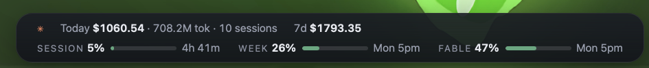
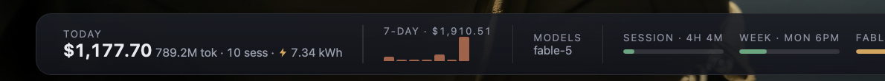
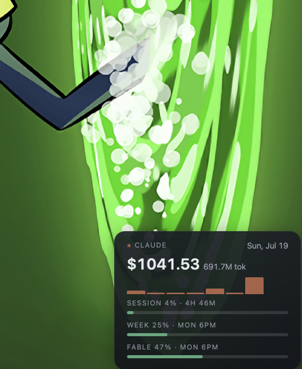

# claude-usage-widget

An [Übersicht](http://tracesof.net/uebersicht/) widget that puts your Claude
usage on your desktop: today's tokens and API-equivalent cost from your local
Claude Code logs, subscription limit gauges (session / weekly / per-model)
with reset countdowns, and an optional energy estimate. Four minimalist
layouts.


## TL;DR — just tell your agent

Life's short. Paste this into Claude Code (or any capable coding agent) and go
get coffee:

```text
Install the claude-usage-widget Übersicht widget on this Mac:

1. If Übersicht isn't installed: `brew install --cask ubersicht`, then open it once.
2. Clone https://github.com/2nspired/claude-usage-widget.git into my usual projects
   directory.
3. Symlink the widget into Übersicht:
   ln -sfn "<clone-path>/claude-usage.widget" \
     "$HOME/Library/Application Support/Übersicht/widgets/claude-usage.widget"
4. Verify `node -v` is ≥ 18 (install via brew if missing).
5. Smoke-test: run `<clone-path>/claude-usage.widget/lib/run.sh` and confirm it prints
   JSON with providers.claude.logs.status "ok" (requires Claude Code with at least one
   past session). If limits.status isn't "ok", warn me to watch for a one-time macOS
   Keychain prompt and click "Always Allow", then re-test.
6. Relaunch Übersicht and confirm the ticker renders at the bottom of my screen.
7. Ask me for my preferences and set them in claude-usage.widget/config.json:
   layout ("ticker" | "ticker-2line" | "bar" | "corner"), position.align
   ("left" | "center" | "right"), position.bottom, and scale (use ~1.5 on 4K/hi-dpi).
8. Local install only — do not commit or push anything.
```

## Install (by hand)

Requires macOS, [Übersicht](http://tracesof.net/uebersicht/), Node ≥ 18, and
[Claude Code](https://claude.com/product/claude-code) (it's where the data
comes from).

```bash
git clone https://github.com/2nspired/claude-usage-widget.git
cd claude-usage-widget
ln -sfn "$PWD/claude-usage.widget" "$HOME/Library/Application Support/Übersicht/widgets/claude-usage.widget"
```

Or drag the `claude-usage.widget` folder into
`~/Library/Application Support/Übersicht/widgets/` in Finder. The symlink
route keeps the widget wired to your checkout so `git pull` picks up updates.

## Configuration

Edit `claude-usage.widget/config.json`. Everything is optional; defaults shown.

| Field | Type | Default | Meaning |
|---|---|---|---|
| `layout` | `"ticker"` \| `"ticker-2line"` \| `"bar"` \| `"corner"` | `"ticker"` | One-line pill · two rows · wide bar with sparkline & model split · compact corner card. |
| `position.bottom` | number (px) | `8` | Distance from the bottom of the screen. |
| `position.align` | `"left"` \| `"center"` \| `"right"` | `"center"` | Horizontal placement. |
| `refreshSeconds` | number | `60` | Documentation of intent only — Übersicht's actual interval is the static `refreshFrequency` export in `index.jsx` (ms); change both to change cadence. |
| `showCost` | boolean | `true` | Show the API-equivalent `$` estimate. |
| `showTokens` | boolean | `true` | Show token counts (`2.1M tok`). |
| `showEnergy` | boolean | `false` | Show the estimated `⚡ kWh` figure (see below). |
| `showFable` | `"auto"` \| `false` | `"auto"` | Model-specific weekly gauge, when your account reports one. |
| `scale` | number | `1` | CSS zoom for the whole widget — use ~`1.5` on 4K/hi-DPI displays. |
| `mock` | boolean | `false` | Render canned sample data instead of real logs/credentials. |

## How it works

A small Node script runs on each refresh and prints one JSON payload:

- **Local logs** — parses `~/.claude*/projects/**/*.jsonl` (Claude Code's own
  session transcripts, read-only), aggregates tokens per day/model, and prices
  them at pay-as-you-go API rates from `lib/pricing.json`. Cached by file
  mtime so refreshes stay cheap.
- **Limit gauges** — the unofficial endpoint behind Claude Code's `/usage`
  command, authenticated with your existing Claude Code OAuth token from the
  macOS Keychain (one-time "Always Allow" prompt; multi-account aware).
  Results cache for 5 minutes and fall back to last-known data (marked
  "cached") if the endpoint hiccups. If Anthropic ever changes the endpoint,
  the gauges disappear and everything else keeps working.

> **The `$` figure is an API-equivalent estimate, not money spent.** On a
> Max/Pro subscription it's what today *would have* cost at API rates — a
> usage gauge (and a strong argument for the subscription), not a bill.
> **The `⚡ kWh` figure is a rough order-of-magnitude estimate** derived from
> public research (coefficients in `lib/logs.js`) — no official per-token
> energy figures exist. A fun gauge, not a meter.

**Privacy:** nothing leaves your machine except the single HTTPS request to
Anthropic's usage endpoint with your own token. No analytics, no telemetry,
no log content transmitted anywhere.

## Troubleshooting

| Symptom | Likely cause |
|---|---|
| No limit gauges, but cost/tokens show fine | Not logged into Claude Code (`claude login`), or you clicked "Deny" on the Keychain prompt — delete the stale Keychain entry and re-run `claude login` to get a fresh prompt, or set `CLAUDE_USAGE_WIDGET_NO_KEYCHAIN=1` if you're intentionally opting out. On first run (before any cache exists), the endpoint may return HTTP 429 (rate-limited); wait a minute and refresh — once one fetch succeeds, the cache prevents recurrence. |
| Cost shows `$0.00` (or low) for a model you used | That model id isn't in `lib/pricing.json` — unknown models price as `$0`. Add a row (all rates $/MTok). |
| Nothing renders at all | Node.js missing or not on Übersicht's minimal `PATH`. `run.sh` checks `node`, `/opt/homebrew/bin/node`, `/usr/local/bin/node`; `brew install node`. |
| Both cost and gauges say "no data" | No Claude Code logs under any `~/.claude*/projects` — use Claude Code at least once. |
| Widget code changes don't appear, but numbers update | Übersicht's file-watcher can die silently. Fully quit and relaunch — note `killall Übersicht` can fail silently on the umlaut; use `pkill -f "bersicht.app"` or the menu-bar icon. Persisting? Clear `~/Library/Caches/tracesOf.Uebersicht`. |
| Small "cached" label on the gauges | The limits endpoint is unreachable/rate-limited right now; the widget is showing last-known gauges by design. |

## Screenshots

| Ticker (default) | Ticker, two-line |
|---|---|
|  |  |

| Bar | Corner |
|---|---|
|  |  |

## More

- [Development & testing](docs/development.md)
- [Adding another provider (OpenAI, Gemini, …)](docs/adding-a-provider.md)
- [Widget gallery publishing](docs/publishing.md)

## License

MIT — see [LICENSE](LICENSE).
